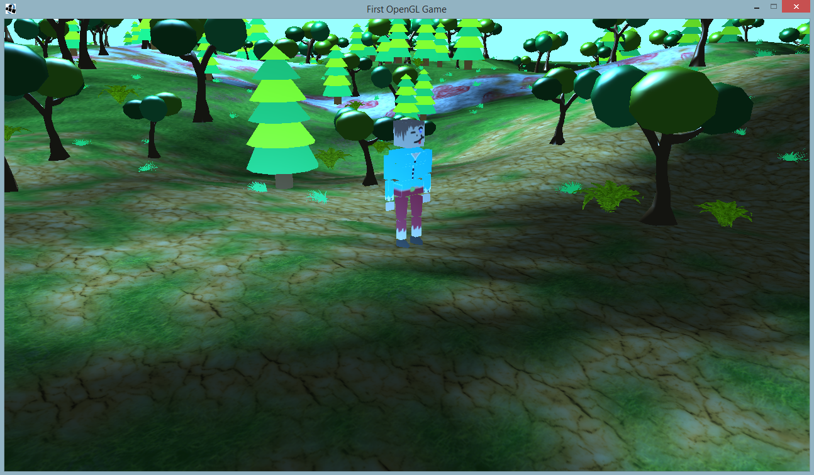

# About project
### Quality: **prototyping**
### Year of creation: 2015

## Scale of quality
**professional**
maintainable, scalable and performing -> well thought out architecture, clean structure, complete documentation

**prototyping**
maintainable and scalable to a certain extent -> rough architecture, clean structure, readable

**OK**
maintainable -> clean structure, readable

**hacky**
just good enough to run

# GameEngine1
Primitive Game Engine I wrote using Java with OpenGL to learn about graphics programming.

